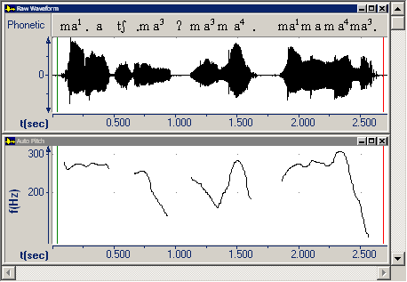

A graph capture contains only the [graphs](../../graphs/overview), title bars, and [transcription bars](../../edit/transcription/guidelines), but does not capture the [menu](../../overview) bar or [toolbar](../../../toolbar/overview).

#### **Related Topics**
[Screen Capture](overview)