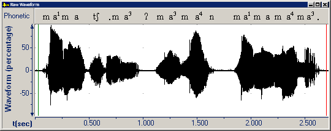

The begin (green) and end (red) cursors were formerly known as the s*tart* and s*top* cursors. This picture shows the initial position of [begin and end cursors](begin-end-cursors) when a file window opens.

####  **Note**
- [Zoom](zoom) helps control the portion of the [active graph](active-graph) between cursors.
- [Cursor alignment](cursor-alignment) adjusts the cursor to **Sample**, **Zero Crossing**, or **Fragment** boundaries.

#### **Related Topics**
[Begin and end cursors](begin-end-cursors)
