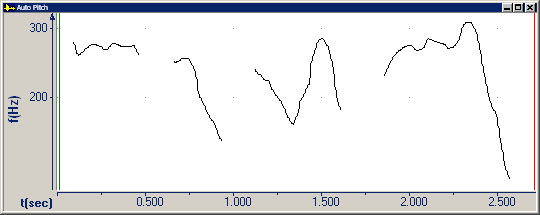
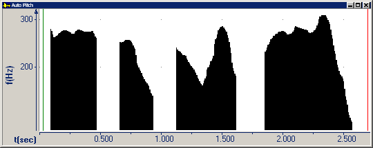
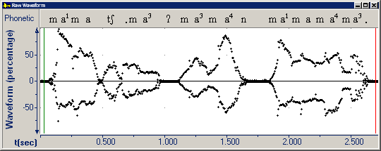

To change the drawing style of the active graph, do the following:

1. Select an [active](active-graph) [graph type](types/overview).
1. On the [Graphs](overview) menu, point to **Drawing Style**, and then click one of the following:
   1. **Line** - does not darken the area below the plot line. **Line** is the default setting for the [Raw Waveform](types/raw-waveform), [Auto Pitch](types/auto-pitch), [Intensity](types/intensity), and [Melogram](types/music/melogram) graphs
   1. **Solid** - darkens-in the area *below* the plot line. Only **Intensity**, **Auto Pitch**, **Melogram**, and Melogram Magnitude plots display with **Solid** style.
   1. **Samples** - displays *many individual sample points*, instead of a continuous line. Only **Raw Waveform** and the **Melogram** graphs display with the **Samples** style.

The following two pictures show the **Auto Pitch** graph, with **Line** and **Solid** drawing style.

The following picture shows the **Raw Waveform** graph in **Samples** drawing style.

####  **Note**
- **Drawing Style** is not available for every graph.
- A **Sample** is a value taken from an audio signal at a precise point in time. The sequence of these samples graphed over time is the waveform (or raw waveform).

#### **Related Topics**
[Graphs overview](overview)
