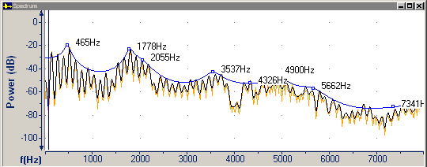
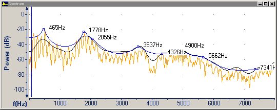
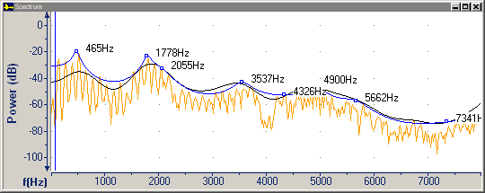

On the [Spectrum tab](spectrum-tab) of the **Graph Parameters** dialog box, you can select a **Smoothing Level** for the cepstral plot line on the [Spectrum graph](../types/spectrum).

In the following screen shots, the cepstral plot line is black.

- Smoothing level 0 (that is, no smoothing) makes the cepstral plot line almost identical to the raw FFT plot line.

- Smoothing level 2 or 3 may improve the detection of [formants](../types/formants).
- Smoothing level 5 is the default.

- Smoothing level 9 may excessively round off peaks.

####  **Note**
- Smoothing is performed by low-time liftering on the cepstrum.

#### **Related Topics**
[Spectrum tab, Graph Parameters](spectrum-tab)
