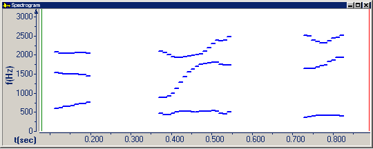

On the **Graph Parameters** dialog box, click the [Spectrogram tab](spectrogram-tab) to *display only* [formants](../types/formants) tracks on a [Spectrogram graph](../types/spectrogram).

1. Select the **Formants Tracks** check box.
1. Select any combination of the **F1**, **F2**, **F3**, or **F4** check boxes.
1. Select **Only**.

This example shows *only* formant tracks.

####  **Note**
- You can [overlay formant tracks](formant-tracks-overlaid) on a **Spectrogram** graph.
- The formant frequencies appear in the [status bar](../../tools/status-bar).

#### **Related Topics**
[Spectrogram tab, Graph Parameters](spectrogram-tab)
