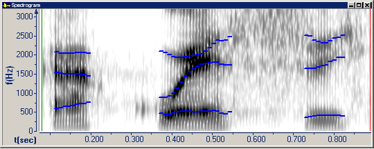

On the **Graph Parameters** dialog box, click the [Spectrogram tab](spectrogram-tab) to *overlay* [formants](../types/formants) tracks on a [Spectrogram graph](../types/spectrogram).

1. Select the **Formants Tracks** check box.
1. Select any combination of the **F1**, **F2**, **F3**, or **F4** check boxes.
1. Select **Overlaid**.

This example show the **F1**, **F2**, and **F3** formants tracks.

####  **Note**
- You can [display only formant tracks](formant-tracks-only) on a **Spectrogram** graph.
- The formant frequencies appear in the [status bar](../../tools/status-bar).

#### **Related Topics**
[Spectrogram tab, Graph Parameters](spectrogram-tab)
