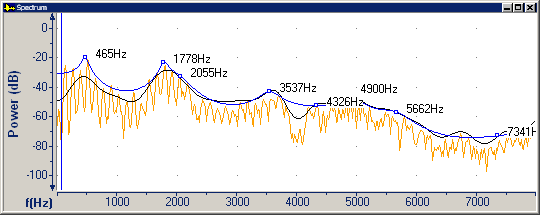
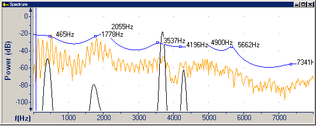

On the [Spectrum tab](spectrum-tab) of the **Graph Parameters** dialog box, you can select a **Peak Sharpening Factor** for the cepstral and LPC plot lines on the [Spectrum graph](../types/spectrum).

In the following screen shots, the cepstral plot line is black and the LPC plot line is blue.

- Peak sharpening factor 0 (that is, no peak sharpening).

- Peak sharpening factor 9.

#### **Related Topics**
[Spectrum tab, Graph Parameters](spectrum-tab)
