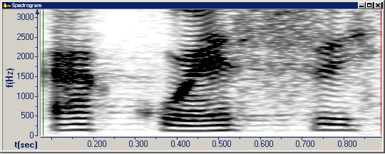
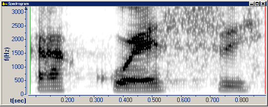
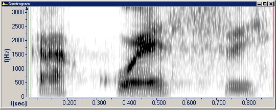

On the **Graph Parameters** dialog box, click the [Spectrogram tab](spectrogram-tab) or **Snapshot** tab to adjust the **Spectral Resolution**.

- **Narrow Band Filter (45 Hz)** resolves fine spectral details such as pitch harmonics, but smears temporal details.

- **Medium Band Filter (172 Hz)** balances the resolution of spectral and temporal details.

- **Wide Band Filter (300 Hz)** resolves fine temporal features such as glottal pulses, but smears spectral details.

#### **Related Topics**
[Spectrogram tab, Graph Parameters](spectrogram-tab)
