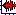

You can use the Record Overlay to mimic an existing recording, by recording an overlay recording. After the new recording finishes, the graphs from the new recording *automatically* overlay on the graphs from the existing recording, so you can see if the new graphs are similar to the original.

1. Do one of the following:
   1. On the **Graphs** menu, point to **Overlay**, and then click **Record Overlay**.
   1. On the [toolbar](../../toolbar/toolbar), click **Record Overlay **

The **Record Overlay** dialog box appears.

1. Do not record immediately.

The **Record Overlay** dialog box displays **Waiting for 2 seconds of silence**, to ensure you are ready.

After a two-second pause is identified, the dialog box displays **Waiting for input**. The **Record Overlay** is now ready to record.

1. On the **Record Overlay** dialog box, do any of the following:
   1. To adjust the audio input volume, move the **Rec Vol** slider or use the arrows.
   1. To adjust the playback volume, move the **Play Vol** slider or use the arrows.
   1. To play the overlay, once you have recorded one, click **Play**.

In the **Time** area, the **Cur** time displays the *current recording time* of the overlay. The **End** time displays the *total recording time* of the overlay.

1. To play the original recording, click **Original**.
1. To close the **Record Overlay** dialog box, click **Close**.
1. To change the color of a *graph overlay* to more easily distinguish it from the underlying graph, do the following:
   1. On the **Tools** menu, click **Options**, and then click the [Colors tab](../tools/options/colors-tab).
   1. In **Graphs**, select **Second Data**, and then select a **Basic** or **Custom** color.

####  **Note**
- Make sure the **Record Level** indicator does not turn *red* frequently, because recording quality will suffer.

#### **Related Topics**
[Overlay](../graphs/overlay)
