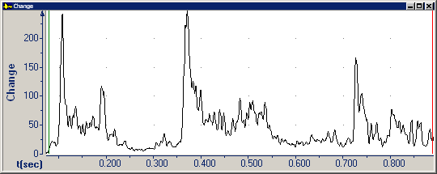

The **Change** graph displays the amount of change in frequency characteristics. Because different phones usually have different frequency content, peaks indicate possible segment boundaries.

This graph is intended for expert phoneticians. It displays the Average Magnitude Difference Function (AMDF), which is a measure of how well a signal matches a time-shifted version of itself, as a function of the amount of time shift. The match is calculated using subtraction (instead of multiplication, as in autocorrelation), which reduces computational time.

####  **Note**
- On the [status bar](../../tools/status-bar), the four panes display:
  - The beginning time interval.
  - The time between the [begin and end cursor](../begin-end-cursors).
  - The amount of change at the begin cursor.
  - The amount of change at the end cursor.
- You can also use the [Zero Crossing graph](zero-crossing) to find segment boundaries for fricatives.

#### **Related Topics**
[Graph Types overview](overview)

