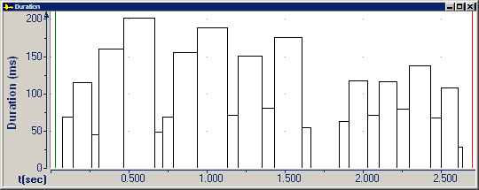

The **Duration** graph displays the duration of [transcribed](../../edit/transcription/overview) phonetic segments.

####  **Note**
- On the [status bar](../../tools/status-bar), the two panes display:
  - The beginning time interval.
  - The duration of the segment at the begin cursor in milliseconds (ms).

#### **Related Topics**
[Graph Types overview](overview)
