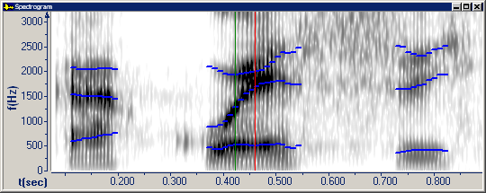

The **F1 v. F2 v. F3** graph displays the first three [formants](formants) of a vowel at the begin cursor. A square dot in the plot area marks the intersection of F1 on the horizontal axis, F2 on the diagonal (depth) axis, and F3 on the vertical axis. Nasalized and other modified vowels may not plot correctly. Notice the direction of increasing F2 values.

To display this graph, do the following:

1. On the **Graphs** menu, click [Types](overview), and then select the **Spectrogram** and **F1 v. F2 v. F3** graphs.
1. In the **Spectrogram** graph, click in a vowel.

A square dot appears in the plot area of the **F1 v. F2 v. F3** graph.

1. If **Select voiced region** appears, make sure that you select a vowel.
1. If **Data Out of Range** appears, one of the formants is too low or too high to appear on the graph. The formant values appear on the status bar.
1. If **No Vowels Defined For Selected Gender** appears, select the correct gender on the [Source tab](../../file/information/source-tab) of the **File Information** dialog box.

####  **Note**
- If you right-click the plot area, and then click **Parameters**, the **Graph Parameters** dialog box appears with the [Formants tab](../parameters/formants-tab) selected.
- On the [status bar](../../tools/status-bar), the two panes display F1, F2, and F3.
- Formants in the **F1 v. F2 v. F3** graph correspond to formant tracks in the [Spectrogram graph](spectrogram). Formants on the LPC plot line in the [Spectrum graph](spectrum) are calculated in a *slightly* different way.

#### **Related Topics**
[Formant Charts](formant-charts)