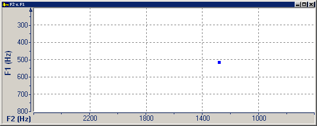
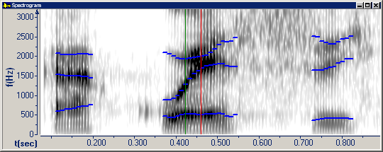

The **F2 v. F1** graph displays the first two [formants](formants) of a vowel at the begin cursor. A square dot in the plot area marks the intersection of F2 on the horizontal axis and F1 on the vertical axis. Nasalized and other modified vowels may not plot correctly. Notice the direction of increasing F1 values.

To display this graph, do the following:

1. On the **Graphs** menu, click [Types](overview), and then select the **Spectrogram** and **F2 v. F1** graphs.
1. In the **Spectrogram** graph, click in a vowel.

A square dot appears in the plot area of the **F2 v. F1** graph.

1. If **Select voiced region** appears, make sure that you select a vowel.
1. If **Data Out of Range** appears, one of the formants is too low or too high to appear on the graph. The formant values appear on the status bar.
1. If **No Vowels Defined For Selected Gender** appears, select the correct gender on the [Source tab](../../file/information/source-tab) of the **File Information** dialog box.

####  **Note**
- If you right-click the plot area, and then click **Parameters**, the **Graph Parameters** dialog box appears with the [Formants tab](../parameters/formants-tab) selected.
- On the [status bar](../../tools/status-bar), the two panes display F1 and F2.
- Formants in the **F2 v. F1** graph correspond to formant tracks in the [Spectrogram graph](spectrogram). Formants on the LPC plot line in the [Spectrum graph](spectrum) are calculated in a *slightly* different way.
- The [F1 v. F2 graph](f1-v-f2) displays F1 on the horizontal axis and F2 on the vertical axis.

#### **Related Topics**
[Formant Charts](formant-charts)
