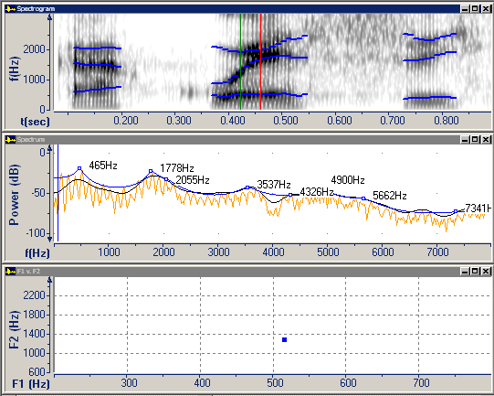

*Formants* (or formant frequencies) are the resonant frequencies of the vocal tract. The term is also used to refer to the peaks in the spectrum caused by these resonances. Individual formants are numbered in order of ascending frequency (as in F1, F2, F3, and so on).

Speech Analyzer can display formants on the following graphs.

- Formant tracks on a [Spectrogram graph](spectrogram).
- FFT, cepstral, and LPC plot lines on a [Spectrum graph](spectrum).
- The first two or three formants of a vowel on a [Formant Chart](formant-charts).

####  **Note**
- Formants on [Formant Charts](formant-charts) correspond to formant tracks on a [Spectrogram graph](spectrogram). Formants on the LPC plot line on a [Spectrum graph](spectrum) are calculated in a *slightly* different way.
- Formant tracks in a **Spectrogram** graph are calculated using a bank of 1st order LPC tracking filters based on:

Mustafa, Kamran, and Ian C. Bruce, "Robust Formant Tracking for Continuous Speech with Speaker Variability," *IEEE Transactions on Audio, Speech, and Language Processing*, Vol. 14, No. 2, March 2006.

- Formant estimates in a **Spectrum** graph are calculated using an LPC model whose order is based on a sampling frequency (Fs / 1000 + 2).

#### **Related Topics**
[Formant Charts](formant-charts)
