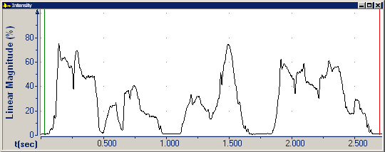

*Intensity* (or physical intensity) is the instantaneous energy delivered by a sound, relative to a fixed energy level. This is the acoustic correlate of the (psychoacoustic) loudness. *Loudness* is the quality of a sound that is the primary psychological correlate of physical intensity.

The **Intensity** graph displays the intensity of the recording relative to a reference sound.

####  **Note**
- If you right-click the plot area, and then click **Parameters**, the **Graph Parameters** dialog box appears with the [Intensity tab](../parameters/intensity-tab) selected. You can adjust the display scale on the vertical axis.
- On the [status bar](../../tools/status-bar), the four panes display:
  - The beginning time interval.
  - The time between the [begin and end cursor](../begin-end-cursors).
  - The [relative intensity](../parameters/intensity-tab) at the begin cursor.
  - The [linear magnitude](../parameters/intensity-tab) in percent.

#### **Related Topics**
[Graph Types overview](overview)
