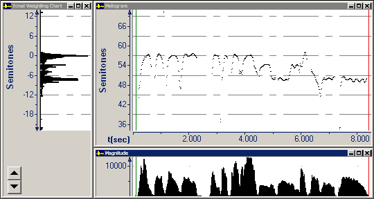

The **Magnitude** graph displays intensity of the melody relative to a reference sound.

It is equivalent to an [Intensity graph](../intensity) for phonetic analysis.

The horizontal axis displays time. It aligns with the [Melogram](melogram).

The vertical axis displays linear magnitude.

####  **Note**
- On the [status bar](../../../tools/status-bar), the four panes display:
  - The beginning time interval.
  - The time between the [begin and end cursor](../../begin-end-cursors).
  - The relative intensity at the begin cursor.
  - The linear magnitude at the begin cursor.

#### **Related Topics**
[Music Graph Types overview](overview)
