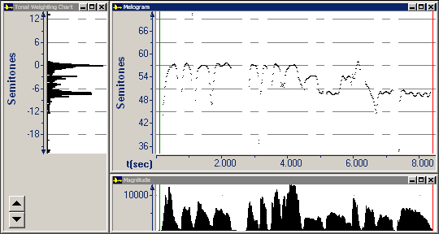

The **Melogram** displays the contour of a melody for [music analysis](analysis).

If you can read music notation but are not familiar with the melogram, you can study [Melogram and Staff examples](melogram-staff-examples) to improve your understanding.

The melogram is equivalent to the [Smoothed Pitch graph](../smoothed-pitch) for phonetic analysis.

The horizontal axis displays time. It aligns with the [Magnitude graph](magnitude).

The vertical axis displays frequency. It aligns with the [Tonal Weighting Chart](tonal-weighting-chart).

####  **Note**
- If you right-click the plot area, and then click **Parameters**, the **Graph Parameters** dialog box appears with the [Music tab](../../parameters/music-tab) selected.

If the actual fundamental frequency of the audio data is below the **Lower Boundary** setting in the **Calculation** area, the Melogram does not display a frequency value.

If the actual fundamental frequency is above the **Upper Boundary** setting in the **Calculation** area, the Melogram might display a sub-harmonic frequency value. For example, if the actual frequency is 1200 Hz, the Melogram might display a frequency of 600 Hz (1/2) or 400 Hz (1/3), depending on the setting.

- On the [status bar](../../../tools/status-bar), the four panes display:
  - The beginning time interval.
  - The time between the [begin and end cursor](../../begin-end-cursors).
  - The pitch at the begin cursor in semitones (st). A *semitone* is a unit of frequency indicating the number of half-steps between a given frequency and a reference frequency. A semitone represents a half step on a musical scale. (The nearest musical note is in parentheses.)

The nearest musical [note](note-reference-chart) is in parentheses.

- The pitch at the begin cursor in hertz (Hz). *Hertz* is a unit of frequency. One hertz equals one cycle per second.

#### **Related Topics**
[Music Graph Types overview](../overview)
