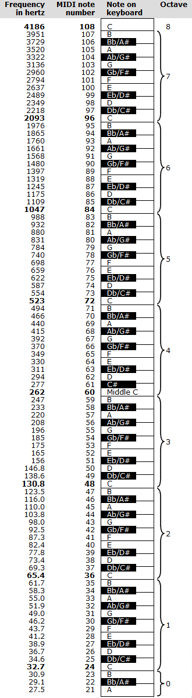

In the following chart, frequencies are rounded to the precision that appears on the [status bar](../../../tools/status-bar) in Speech Analyzer.

The system for numbering notes in Speech Analyzer is based on the international MIDI standard. For more information on the Web, go to <http://www.midi.org>

The highest note on a piano keyboard is C in Octave 8. The lowest note is A in Octave 0. Middle C is in Octave 4.

#### **Related Topics**
[Music analysis](analysis)
