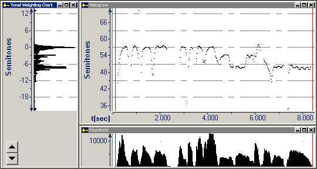

The **Tonal Weighting Chart** is a histogram of pitches in a melody for [music analysis](analysis).

The chart displays intervals smaller than Western semitones. A *semitone* represents a half step on a musical scale.

- You can determine the scale (or tonal inventory) of a melody.
- You can [measure the tonal center](measure-tonal-center) (if one exists) of a melody.

The horizontal scale displays the number of occurrences of a frequency value.

The vertical axis displays fundamental frequency. It aligns with the [Melogram](melogram).

####  **Note**
- If you right-click the plot area, and then click **Parameters**, the **Graph Parameters** dialog box appears with the [Music tab](../../parameters/music-tab) selected.
- To improve the readability of the **Tonal Weighting Chart**, you can close the [Raw Waveform](../raw-waveform), [Position View](../position-view), and **Magnitude** graphs.
- If you need to adjust **0** up or down on the axis to align with the tonal center, you can click the arrow buttons at the lower left of graph.
- To measure a value on the status bar, click to move the private (blue) cursor\*.
- On the [status bar](../../../tools/status-bar), the four panes display:
  - Pitch of the zero line in semitones.
  - Difference in pitch between the private cursor\* and the zero line.
  - Pitch at the private cursor\* in semitones.

The nearest musical [note](note-reference-chart) is in parentheses.

- Pitch at the private cursor\* in hertz.

#### **Related Topics**
[Music Graph Types overview](../overview)
