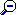

A *waveform* is an audio recording and the graph of its samples. It can also refer to the audio file that contains the recording.

The **Position View** graph displays the entire waveform, even if you [zoom](../zoom) other graphs. The highlighted area corresponds to the area that you can see in other graphs that plot time on the horizontal axis (for example, [Raw Waveform graph](raw-waveform)).

Speech Analyzer displays the **Position View** graph above other graphs. You cannot move it or resize it. You cannot display it alone.

- To display more temporal detail in other graphs, click **Zoom Step In**  on the [toolbar](../../../toolbar/toolbar), or drag the scroll box down on the vertical scroll bar.

In the **Position View** graph, the width of the highlighted area decreases.

- To display more of the waveform in other graphs, click **Zoom Step Out** , or drag the scroll box up on the vertical scroll bar.

In the **Position View** graph, the width of the highlighted area increases.

- To display the entire waveform in other graphs, click **Zoom Full** , or drag the scroll box to the top of the vertical scroll bar.

In the **Position View** graph, the entire waveform is highlighted.

- To display the waveform between the [begin and end cursors](../begin-end-cursors) in other graphs, click **Zoom Cursors** .

In the **Position View** graph, the area between the cursors is highlighted.

- To display a different part of the waveform in other graphs, drag the scroll box on the horizontal scroll bar.

In the **Position View** graph, the highlighted area moves. The width of the highlighted area does not change.

When graphs display the entire waveform, the horizontal scroll bar is unavailable.

####  **Note**
- On the [status bar](../../tools/status-bar), the two panes display:
  - The beginning time interval.
  - The time between the [begin and end cursor](../begin-end-cursors).

#### **Related Topics**
[Graph Types overview](overview)
