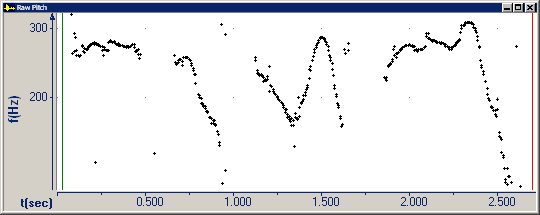

The **Raw Pitch** graph displays a pitch contour determined by three parameters that you can set.

####  **Note**
- If you right-click the plot area, and then click **Parameters**, the **Graph Parameters** dialog box appears with the [Pitch tab](../parameters/pitch-tab) selected. You can adjust the display scale on the vertical axis and manual settings that affect the pitch contour itself.

If the actual fundamental frequency of the audio data is below the **Min Frequency** setting, the graph does not display a frequency value.

If the actual fundamental frequency is above the **Max Frequency** setting, the graph might display a sub-harmonic frequency value. For example, if the actual frequency is 1200 Hz, the graph might display a frequency of 600 Hz (1/2) or 400 Hz (1/3), depending on the setting.

- On the [status bar](../../tools/status-bar), the four panes display:
  - The beginning time interval.
  - The time between the [begin and end cursor](../begin-end-cursors).
  - The pitch at the begin cursor in semitones (st). A *semitone* is a unit of frequency indicating the number of half-steps between a given frequency and a reference frequency. A semitone represents a half step on a musical scale. 
  - The pitch at the begin cursor in hertz (Hz). *Hertz* is a unit of frequency. One hertz equals one cycle per second.
- The **Raw Pitch** graph is equivalent to the Fraw graph in [CECIL](../cecil).

#### **Related Topics**
[Pitch graphs](pitch)

