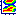

You can preserve a snapshot (that is, make a copy) of the current [Spectrogram graph](spectrogram) before you [zoom](../zoom) or adjust the [parameters](../parameters/spectrogram-tab).

- To make a snapshot, on the [toolbar](../../../toolbar/toolbar) click **Snapshot Spectrogram** .

If you have not made a snapshot, **Zoom other graphs as needed and click the Snapshot Spectrogram button** appears in the plot area.

- to update the Snapshot Spectrogram graph after you zoom a graph, you must click **Snapshot Spectrogram**  again.

####  **Note**
- On the [status bar](../../tools/status-bar), the four panes display:
  - The beginning time interval.
  - The time between the [begin and end cursor](../begin-end-cursors).
  - The frequency at the mouse pointer.
  - The intensity at the mouse pointer.

#### **Related Topics**
[Graph Types overview](overview)
