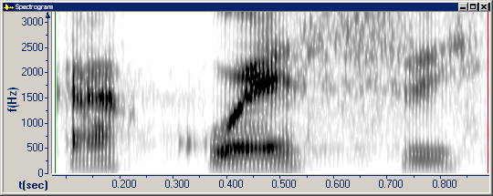

A *spectrogram* is a three-dimensional plot of the intensity of the frequency content of a signal as it changes over time. Usually the vertical axis indicates frequency, the horizontal axis indicates time, and the color or gray scale indicates intensity. In Speech Analyzer, magenta is the color of the highest intensity and dark blue is the color of the lowest intensity.

####  **Note**
- If you right-click the plot area, and then click **Parameters**, the **Graph Parameters** dialog box appears with the [Spectrogram tab](../parameters/spectrogram-tab) selected. You can adjust the upper bound of frequency on the vertical axis, display formant tracks, and so on.
- You can preserve a [snapshot](snapshot-spectrogram) (that is, make a copy) of the current Spectrogram graph before you [zoom](../zoom) or adjust the parameters.
- On the [status bar](../../tools/status-bar), the four panes display:
  - The beginning time interval.
  - The time between the [begin and end cursor](../begin-end-cursors).
  - The frequency at the mouse pointer.
  - The intensity at the mouse pointer.
- To show or hide formant tracks, you can click **Formant Tracks**  on the [toolbar](../../../toolbar/toolbar).

If you show formant tracks, the status bar displays F1, F2, F3, and F4 at the begin cursor.

- Formant tracks are calculated using a bank of 1st order LPC tracking filters based on:

Mustafa, Kamran, and Ian C. Bruce, "Robust Formant Tracking for Continuous Speech with Speaker Variability," *IEEE Transactions on Audio, Speech, and Language Processing*, Vol. 14, No. 2, March 2006.

- Formants on [Formant Charts](formant-charts) correspond to formant tracks on a **Spectrogram** graph. Formants on the LPC plot line on a [Spectrum graph](spectrum) are calculated in a *slightly* different way.
- FFT stands for fast Fourier transform. It is an efficient algorithm to decompose a sound into a spectrum of its frequency components. In Speech Analyzer, the FFT is calculated using 4x oversampling and linear interpolation. A frequency adjustable Hanning window is applied to the data before the FFT is calculated.

#### **Related Topics**
[Graph Types overview](overview)
