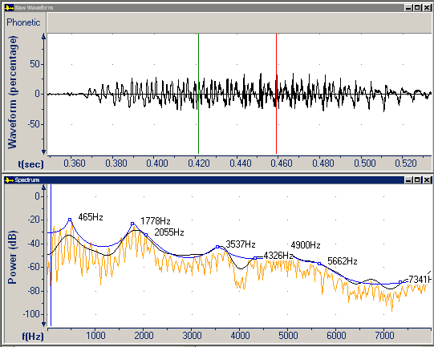

A *spectrum* is a two-dimensional plot of the intensity of the frequency content of a signal. *Frequency* is the number of times a repeated event occurs per unit of time.

The **Spectrum** graph displays the energy levels at each frequency in the audio data, between the [begin and end cursors](../begin-end-cursors).

If **Move cursors closer together** appears, you need to move the begin and end cursors closer together. To move the cursors into the *center* of a phone, you might need to [zoom](../zoom) the [Raw Waveform graph](raw-waveform).

A *plot* is the data points or symbols contained in a graph that may be connected by a line (plot line), and the area that contains them (plot area). The **Spectrum** graph can display three plot lines.

- The FFT plot line displays the unsmoothed fast Fourier transform, which is an efficient algorithm to decompose a sound into a spectrum of its frequency components.
- The cepstral plot line displays the cepstrum, which is the fast Fourier transform of the log (decibel) spectrum. This separates the pitch and vocal tract components, which allows for smoothing.
- The LPC plot line displays the gross features of the spectrum. LPC stands for Linear predictive coding. It is a technique for representing the spectrum of sound in compressed form, based on a linear predictive model.

The [formant](formants) frequencies estimated from the LPC model are shown by squares superimposed on the LPC plot line.

####  **Note**
- If you right-click the plot area, and then click **Parameters**, the **Graph Parameters** dialog box appears with the [Spectrum tab](../parameters/spectrum-tab) selected. You can adjust smoothing, peak sharpening, and so on.
- The *private cursor* is the blue cursor that you can move independently of the begin and end cursors on the **Spectrum** graph and [Tonal Weighting Chart](music/melogram).
- On the [status bar](../../tools/status-bar), the four panes display:
  - The frequency at the private cursor.
  - The value on the cepstral plot line at the private cursor.
  - The value on the FFT plot line at the private cursor.
  - The value on the LPC plot line at the private cursor.
- To make accurate measurements, you can maximize the graph.
- A Gaussian window is applied to the audio data before the FFT is calculated.
- Formant estimates on the LPC plot line are calculated using an LPC model whose order is based on the sampling frequency (Fs / 1000 + 2). Formant tracks on a [Spectrogram graph](spectrogram) are calculated in a *slightly* different way.
- You can [change Spectrum plot line colors](change-spectrum).

#### **Related Topics**
[Graph Types overview](overview)
