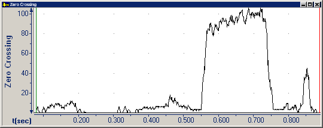

A *zero crossing* is a point where an audio waveform crosses the zero-line from negative to positive.

The **Zero Crossing** graph displays the count of zero crossings over a brief time interval.

The oscillation around the zero line is a measure of high-frequency sound content. The higher the zero crossing value, the greater the high-frequency component in the audio data. Fricatives generally have a high zero-crossing value.

####  **Note**
- On the [status bar](../../tools/status-bar), the four panes display:
  - The beginning time interval.
  - The time between the [begin and end cursor](../begin-end-cursors).
  - The number of zero crossings at the begin cursor.
  - The number of zero crossings at the end cursor.
- If you want the cursors to snap to the nearest zero crossing, select **Zero Crossing** in the [Cursor Alignment](../cursor-alignment) area on the [View tab](../../tools/options/view-tab) of the **Options** dialog box.

#### **Related Topics**
[Graph Types overview](overview)